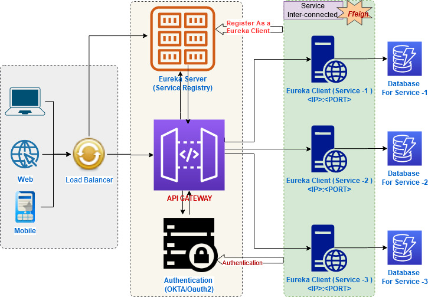

### MICROSERVICE - JWT


### Explain
1. User call API via only one endpoint (localhost:9000)
2. Api gateway distribute and route to microservices
3. Service Registry will control all of microservices
4. Server config will save, share hystrix config file
5. Zipkin will control code, CI/CD 

### Build and Run Microservice
- cd to microservice folders
```
$ mvn spring-boot:run
OR
$ mvn clean install
$ jar -jav .\target\{serviceName}.0.0.SNAPSHORT.jar

```
1. Setup data
```
- Set up mysql
- run script: pa_task_management.sql
```
2. Run redis server 
```
- window: unzip Redis-x64-5.0.14.1.zip and run redis-server.exe
- macOs: cd redis-server
    1. install docker application
    2. $ docker-compose up -d
```
3. service-registry
4. cloud-config-server
5. cloud-gateway
6. hystrix-dashboard
7. auth-server
8. department-service
9. user-service
